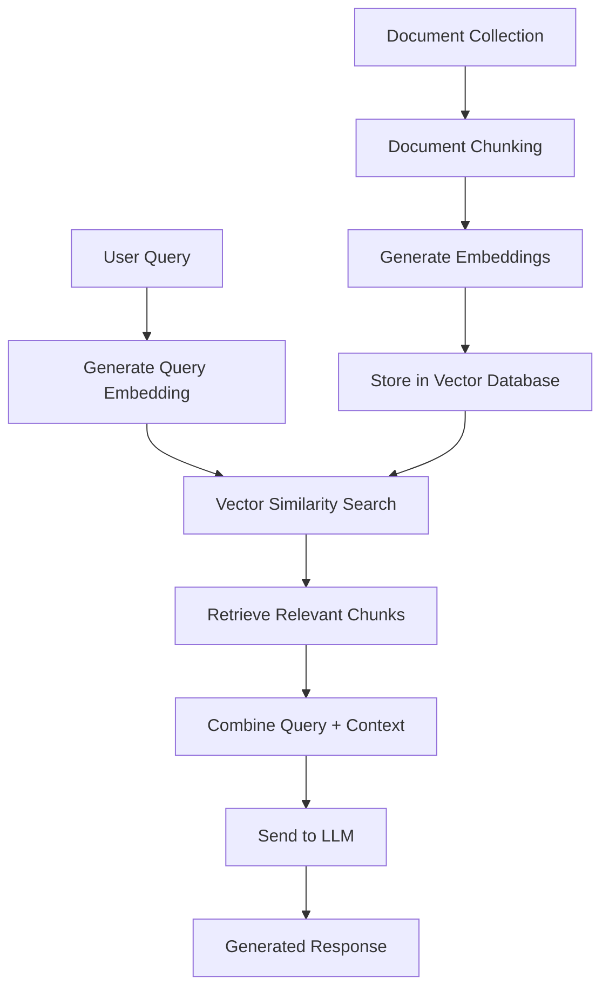

```mermaid
graph TD
    A[Document Collection] --> B[Document Chunking]
    B --> C[Generate Embeddings]
    C --> D[Store in Vector Database]
    
    E[User Query] --> F[Generate Query Embedding]
    F --> G[Vector Similarity Search]
    D --> G
    
    G --> H[Retrieve Relevant Chunks]
    H --> I[Combine Query + Context]
    I --> J[Send to LLM]
    J --> K[Generated Response]
```